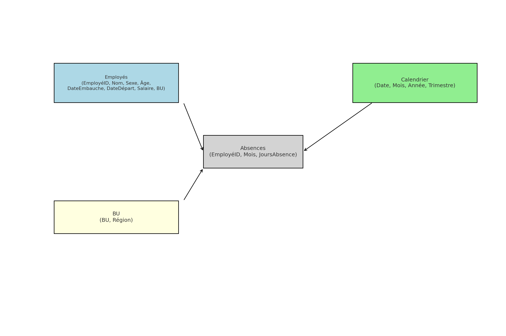

# 📊 Projet BI – Suivi RH multi-sites avec Power BI

## 🧾 Contexte

Ce projet a été conçu dans le cadre d’une simulation de mission de Data Analyst chez **Athome Solution**, pour un client du secteur de la santé. L’objectif est de mettre en place une solution de Business Intelligence permettant de suivre les effectifs, le turnover et l’absentéisme d’un groupe réparti en plusieurs entités (Business Units).

---

## 🎯 Objectifs

- Créer un modèle de données optimisé (modèle en étoile)
- Développer un dashboard interactif avec Power BI
- Implémenter la sécurité d’accès avec **Row-Level Security (RLS)**
- Simuler l’automatisation du rafraîchissement des données
- Documenter le processus pour un transfert ou une industrialisation

---

## 🗃️ Données utilisées

Les données sont simulées à l’aide de la librairie Faker en Python.

### `employes.csv`  
Contient les données RH individuelles :
- EmployéID, Nom, Sexe, Âge, Poste, BU
- Salaire, DateEmbauche, DateDépart, Statut

### `absences.csv`  
Contient le nombre de jours d’absence mensuels par employé :
- EmployéID, Mois, JoursAbsence

---

## 📐 Modèle de données

### Type de schéma utilisé : **Modèle en étoile**

> La table centrale `Absences` est reliée à plusieurs dimensions : `Employés`, `BU`, `Calendrier`.

### Pourquoi ce choix ?

Le **modèle en étoile** est :
- Facile à comprendre
- Performant dans Power BI
- Idéal pour des analyses claires et orientées métiers

---

## 📊 Indicateurs calculés

- Effectif total (global et par BU)
- Taux de turnover mensuel
- Jours d’absence moyen par BU
- Taux de présence
- Évolutions mensuelles (%) des indicateurs clés

---

## 🛠️ Fonctionnalités Power BI

- Slicers : Mois, BU, Poste
- Pages :
  - Vue d’ensemble globale
  - Détail par BU
  - Vue individuelle employé
- DAX pour calculs dynamiques
- Table calendrier générée dans Power BI

---

## 🔐 Sécurité (Row-Level Security)

Mise en place de la RLS :
- Table de mapping utilisateur ↔ BU
- Utilisation de `USERPRINCIPALNAME()` pour restreindre dynamiquement l’accès aux données
- Test via "Afficher en tant que rôle" dans Power BI Desktop

---

## 🔄 Automatisation (Simulation)

- Les données peuvent être stockées dans Azure SQL / Azure Data Lake
- Power BI Service peut automatiser les refresh via OneDrive, SharePoint, ou Azure Data Factory
- Projet structuré pour un **déploiement Dev → Test → Prod**

---

## 💬 Comparaison des modèles BI

| Schéma        | Simplicité | Performance | Maintenance | Cas d’usage |
|---------------|------------|-------------|-------------|-------------|
| ⭐ Étoile      | ✅✅✅       | ✅✅✅        | ✅✅          | Power BI, rapports métier |
| ❄️ Flocon     | ✅✅         | ✅            | ✅✅✅        | Entrepôt relationnel, SI |
| 🌌 Constellation | ❌          | ✅✅          | ❌❌          | DW multi-sujets, grande échelle |

---

## 📁 Fichiers inclus

📁 /projet-rh-powerbi
├── employes.csv
├── absences.csv
├── rapport_rh.pbix
├── schema_modele_donnees.png
├── README.md

---

## 👨🏾‍💻 Réalisé par

**Massamba GUEYE**  
Consultant Data & BI 
📧 m.massamba.gueye@gmail.com  
📱 +33 7 58 54 81 22

---

